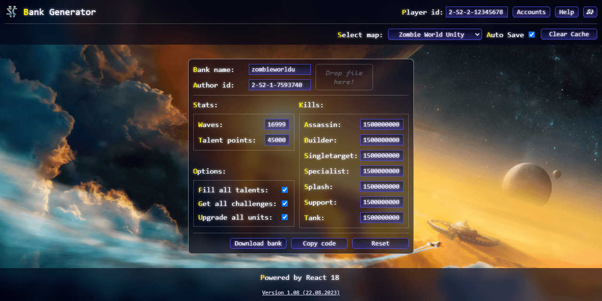

<b>StarCraft2 Bank Restorer</b>  
Simple StarCraft2 custom maps bank restorer :trollface: 
For people who lost their save and dont want to grind again :rocket:

:point_right: https://darthvan.github.io/StarCraft2-Bank-Restorer/ :point_left: 

List of available maps: <b>
<dl>
 <dd>
  Any Simple - text editor for simple banks, that protected with signature only 
  Runling Run 4 
  Runling Run 8 
  Swarm Special Forces 
  Zombie City 
  Zombie World Unity 
 </dd>
</dl></b>

:balloon: Features: account switcher, saving edited banks in local storage, updates checker, 8bit player ♪

 More maps will come later.